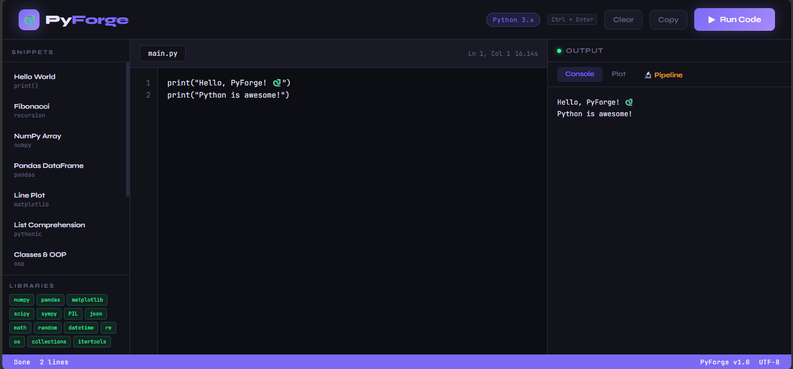
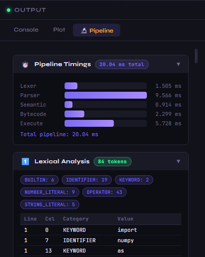
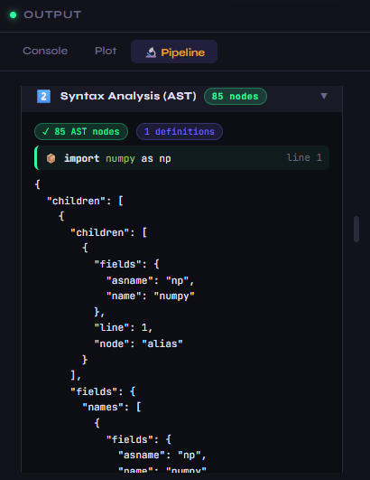
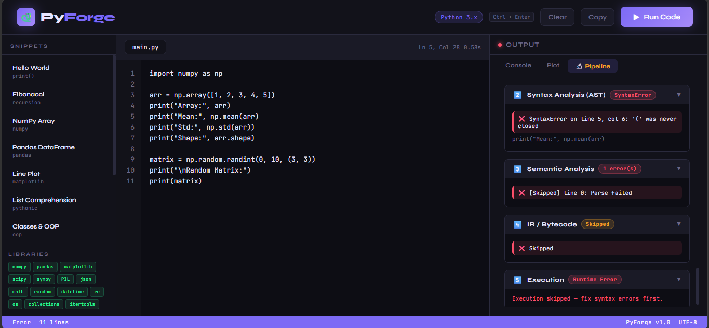
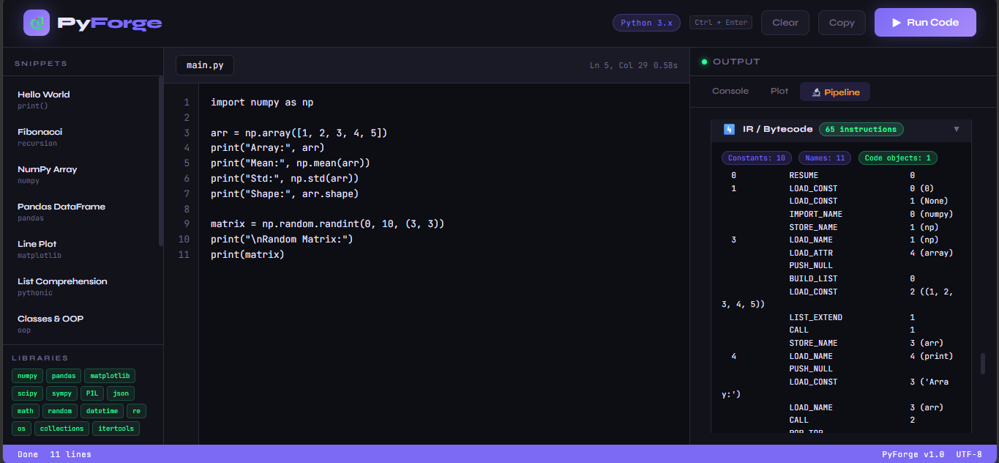
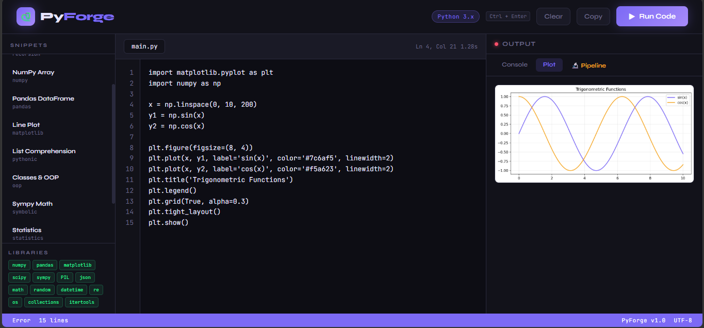

<div align="center">

# 🔥 PyForge

### A Full-Stack Python Compiler with a 5-Stage Compilation Pipeline

*Built for Compiler Construction — CS undergraduate course project*


</div>

---

## What is PyForge?

PyForge is a browser-based Python IDE that doesn't just *run* your code — it compiles it. Every time you hit **Run**, your source code travels through a full five-stage compiler pipeline: lexical analysis, syntax analysis, semantic analysis, bytecode generation, and execution. You can watch each stage unfold in real time through the **🔬 Pipeline** tab.

This project was built as a Compiler Construction course project to demonstrate how a real compiler frontend works — from raw characters to executable instructions.

---

## Live Demo of the Pipeline

```
Source Code
     │
     ▼
┌─────────────────┐
│  1. Lexer       │  Tokenizes source → KEYWORD, IDENTIFIER, NUMBER_LITERAL, OPERATOR...
└────────┬────────┘
         │
         ▼
┌─────────────────┐
│  2. Parser      │  Builds Abstract Syntax Tree (AST) — node count, definitions, structure
└────────┬────────┘
         │
         ▼
┌─────────────────┐
│  3. Semantic    │  Detects undefined names, unused imports, shadowed builtins, dead code
└────────┬────────┘
         │
         ▼
┌─────────────────┐
│  4. Bytecode    │  CPython bytecode via dis — instructions, code objects, constants
└────────┬────────┘
         │
         ▼
┌─────────────────┐
│  5. Execution   │  Sandboxed exec() with full stdlib + NumPy, Pandas, Matplotlib...
└─────────────────┘
```

---

## Features

### Compiler Pipeline (the core)
- **Lexical Analysis** — tokenizes source code using Python's `tokenize` module; categorizes every token (KEYWORD, IDENTIFIER, STRING_LITERAL, NUMBER_LITERAL, OPERATOR, BUILTIN) with line and column positions; shows a category frequency summary
- **Syntax Analysis** — builds a full AST using the `ast` module; extracts all function definitions, class definitions, and imports with line numbers; returns structured node-by-node tree representation
- **Semantic Analysis** — walks the AST to catch: undefined name usage, unused imports, assignments that shadow Python builtins, and unreachable code after `return`/`raise`/`break`
- **IR / Bytecode Generation** — compiles to CPython bytecode and disassembles with `dis`; lists all nested code objects (functions, classes) with their local variables, constants, and argument counts
- **Execution** — runs code in a sandboxed environment with a 30-second timeout; captures stdout, stderr, and matplotlib plots separately

### IDE Features
- Syntax-aware code editor with line numbers
- `Ctrl+Enter` to run, `Tab` for indentation, `Ctrl+/` to toggle comments
- 11+ built-in code snippets (sorting algorithms, data structures, matplotlib plots, NumPy demos, and more)
- Real-time execution status and timing display
- Matplotlib plot rendering directly in the browser (base64 PNG)
- Console, Plot, and 🔬 Pipeline output tabs

### Pipeline Viewer
- Collapsible sections for each compiler stage
- Token table with color-coded categories
- AST tree with definitions summary
- Semantic issue list (errors in red, warnings in amber)
- Bytecode disassembly with code object hierarchy
- Stage-by-stage timing bar chart

---

## Project Structure

```
PyForge/
├── index.html      # Frontend — IDE interface + Pipeline viewer (vanilla HTML/CSS/JS)
├── server.py       # Backend — Flask server with 5-stage compiler pipeline
├── start.sh        # One-command startup script
└── README.md
```

The entire frontend is a single `index.html` file (no framework, no build step). The backend is a single `server.py` file. No database. No configuration files.

---

## Getting Started

### Prerequisites

- Python 3.10 or higher
- pip

### Installation

**Option A — one command (recommended)**
```bash
bash start.sh
```
This installs all dependencies and starts the server automatically.

**Option B — manual**
```bash
# Install dependencies
pip install flask flask-cors numpy pandas matplotlib scipy sympy Pillow requests

# Start the server
python server.py
```

Then open `index.html` in your browser. That's it.

---

## API Reference

The backend exposes five REST endpoints:

| Method | Endpoint | Description |
|--------|----------|-------------|
| `POST` | `/compile` | Runs all 5 pipeline stages; returns tokens, AST, semantic issues, bytecode, output, and per-stage timings |
| `POST` | `/run` | Backward-compatible run-only endpoint; returns output, stderr, and plot |
| `POST` | `/analyze` | Runs stages 1–4 only (no execution); useful for static analysis |
| `GET` | `/libraries` | Returns availability status of all supported libraries |
| `GET` | `/health` | Health check; returns server status and Python version |

### Example: `/compile` request

```bash
curl -X POST http://localhost:5000/compile \
  -H "Content-Type: application/json" \
  -d '{"code": "x = 1 + 2\nprint(x)"}'
```

### Example: `/compile` response shape

```json
{
  "timings": {
    "lexer": 0.812,
    "parser": 1.204,
    "semantic": 0.943,
    "bytecode": 0.571,
    "execute": 23.18,
    "total": 26.71
  },
  "stages": {
    "lexer": {
      "tokens": [...],
      "token_count": 9,
      "category_summary": { "NUMBER_LITERAL": 2, "OPERATOR": 1, ... },
      "success": true
    },
    "parser": {
      "success": true,
      "node_count": 7,
      "definitions": [],
      "ast_tree": { "node": "Module", "children": [...] }
    },
    "semantic": {
      "success": true,
      "errors": [],
      "warnings": [],
      "scope_info": { "module_level_names": ["x"], ... }
    },
    "bytecode": {
      "success": true,
      "instructions": ["  2           0 LOAD_CONST   1 (3)", ...],
      "code_objects": [{ "name": "<module>", "depth": 0, ... }]
    },
    "execute": {
      "output": "3\n",
      "error": "",
      "plot": null
    }
  }
}
```

---

## Libraries Available at Runtime

All of these are pre-imported in the execution sandbox — no `import` needed in your code (though it works fine if you do import them):

| Category | Libraries |
|----------|-----------|
| Scientific | `numpy`, `scipy`, `sympy` |
| Data | `pandas` |
| Visualization | `matplotlib`, `PIL` (Pillow) |
| Networking | `requests` |
| Standard Library | `math`, `random`, `datetime`, `re`, `json`, `csv`, `os`, `sys`, `collections`, `itertools`, `functools`, `statistics`, `pathlib`, `typing`, `dataclasses`, `enum`, `heapq`, `bisect`, `queue`, `hashlib`, `base64`, `struct`, `io`, `contextlib`, `abc`, `string`, `textwrap`, `decimal`, `fractions` |

---

## Keyboard Shortcuts

| Shortcut | Action |
|----------|--------|
| `Ctrl + Enter` | Run code |
| `Tab` | Insert 4 spaces |
| `Shift + Tab` | Remove indentation |
| `Ctrl + /` | Toggle line comment |

---

## Compiler Concepts Demonstrated

This project is a practical implementation of the following Compiler Construction topics:

- **Scanning / Lexical Analysis** — breaking source text into a stream of classified tokens
- **Parsing / Syntax Analysis** — building a hierarchical Abstract Syntax Tree from the token stream
- **Semantic Analysis** — traversing the AST to enforce language semantics beyond what syntax rules capture (scope, name resolution, type compatibility)
- **Intermediate Representation** — CPython bytecode as a stack-based IR, one step below source and one step above machine code
- **Symbol Table** — tracking defined names, their scopes, and usage across the module
- **Error Recovery** — reporting multiple errors across stages rather than stopping at the first failure

---

## Technical Notes

**Why Python's own `ast` and `tokenize` modules?**
They implement the same lexer and parser that CPython uses internally. This means PyForge's pipeline processes code identically to how the real Python interpreter does it — there's no toy grammar or approximation.

**Sandboxing**
Code runs in a restricted `exec()` environment. The execution is wrapped in a daemon thread with a hard 30-second timeout. There is no filesystem write access and no network access from within user code.

**Semantic analysis limitations**
The semantic analyzer performs conservative static analysis on module-level scope. It will report false positives for names defined dynamically (e.g. via `locals()` manipulation or `exec()`). This is a known limitation of static analysis in dynamically typed languages.

---

## Screenshots

### 🧠 IDE Home


---

### 🔬 Pipeline Overview


---

### 🌳 AST View


---

### ⚠️ Semantic Analysis


---

### ⚙️ Bytecode View


---

### 📊 Execution Output


## Future Improvements

- [ ] Interactive AST tree with click-to-highlight source mapping
- [ ] Control Flow Graph (CFG) visualization
- [ ] Live error squiggles as you type (debounced semantic analysis)
- [ ] Source-to-bytecode linked view with synchronized scrolling
- [ ] Step-through debugger with variable watch panel
- [ ] Custom mini-language transpiler (PyLite → Python)
- [ ] Constant folding and dead code elimination optimizer demo

---

## Author

**Muhammad Salman Khalid Awan** 
BS Computer Science — Lahore Garrison University
Compiler Construction — 6th Semester, 2026

---

## License

This project is licensed under the MIT License.

```
MIT License

Permission is hereby granted, free of charge, to any person obtaining a copy
of this software and associated documentation files (the "Software"), to deal
in the Software without restriction, including without limitation the rights
to use, copy, modify, merge, publish, distribute, sublicense, and/or sell
copies of the Software, and to permit persons to whom the Software is
furnished to do so, subject to the following conditions:

The above copyright notice and this permission notice shall be included in
all copies or substantial portions of the Software.
```

---

<div align="center">

Made with Python, Flask, and too much caffeine ☕ by Salman

</div>
